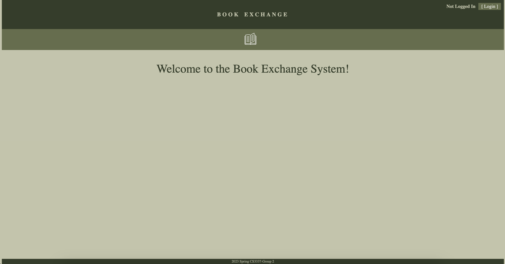
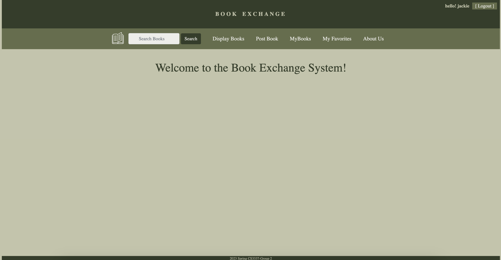
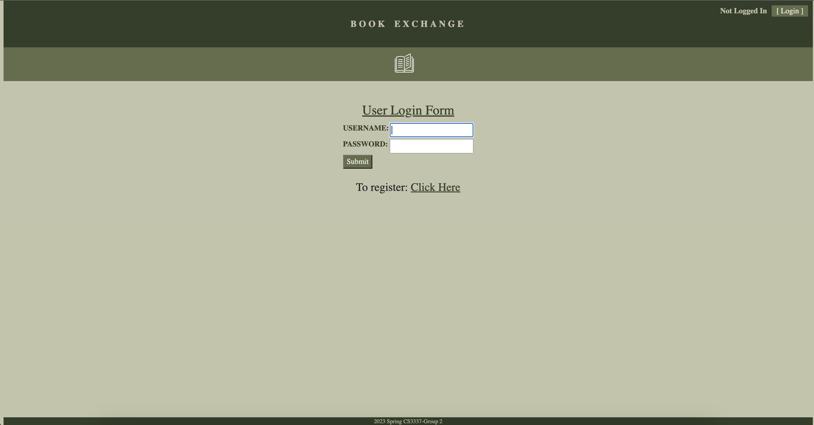
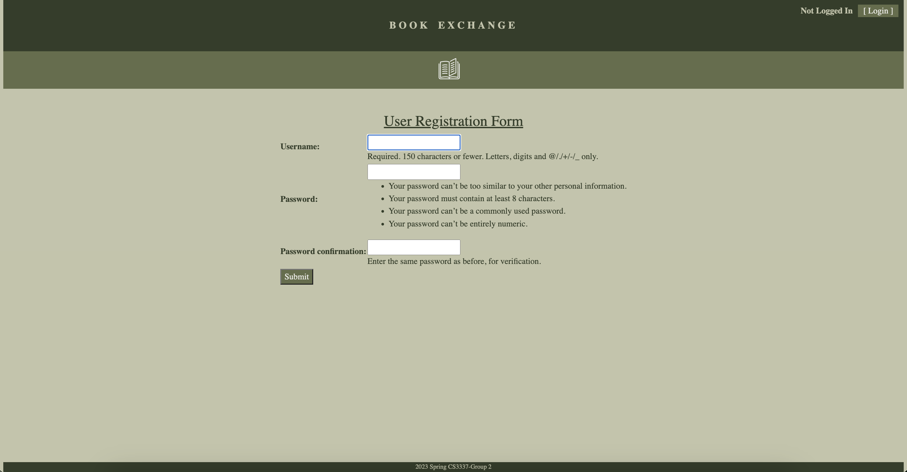
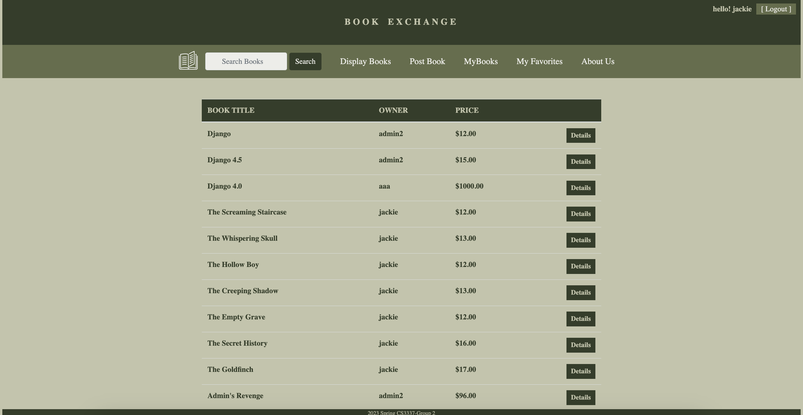
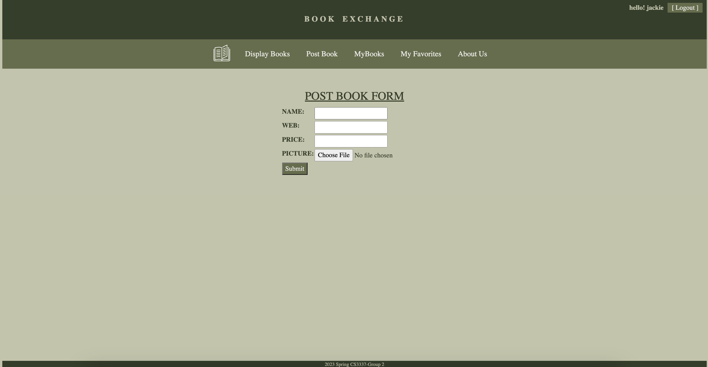
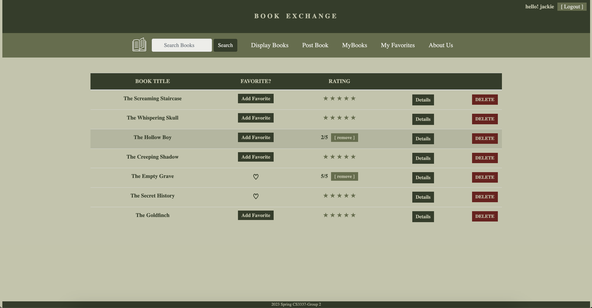
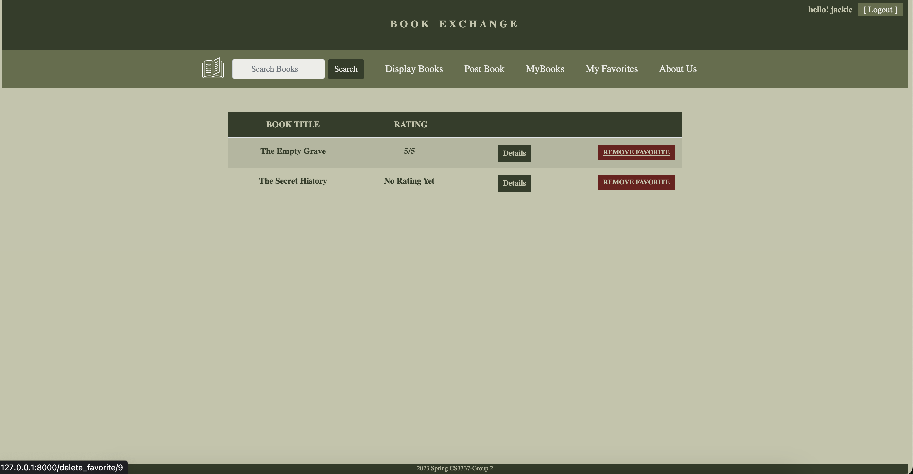
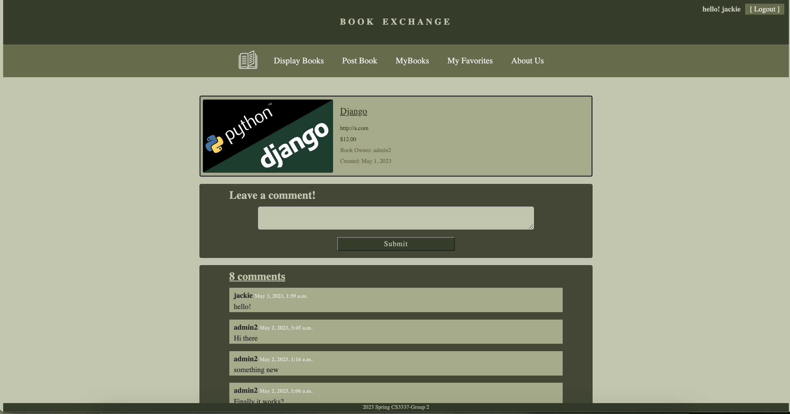
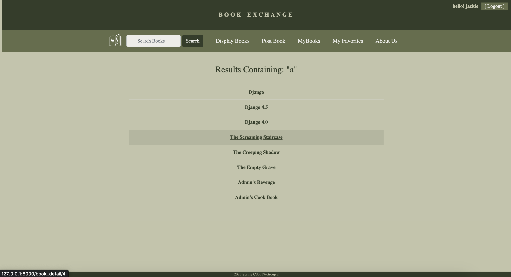

# BookExchange
Web Application allows users to manage and manipulate thier 'books' through a variety of methods (log-in, log-out, register, post, display, favorite, rate, delete, search, comment).

## About the Project

  
  

## Features
### Log-in and Register Page
Feature allows users to log into the application or register an account. This allows them full access to the rest of the features.

  
  

### Display Books Page
Feature allows users to view and interact with all books that have been uploaded to the database.

  

### Post Books Page
Feature allows users to upload new books onto the database, given that they follow the given requirements.

  

### My Books Page
Feature allows users to view and interact with only their books. In this page, they are able to favorite a book, rate a book, and delete a book from the database.

  

### My Favorites Page
Feature allows users to view and interact with their favorited books. In this page, they are able to remove the book from their favorites page.

  

### Book Details Page
Feature allows users to view additional details pertaining to a book. In this page, they are able to add comments and communicate with other users who have commented previously.

  

### Search Page
Feature allows users to search through the database for a specifc book. Once they find the book they are looking for, they are able to be redirected to that book's details page.

  

## Built Using
- Python
- Django
- SQL
- PyCharm
